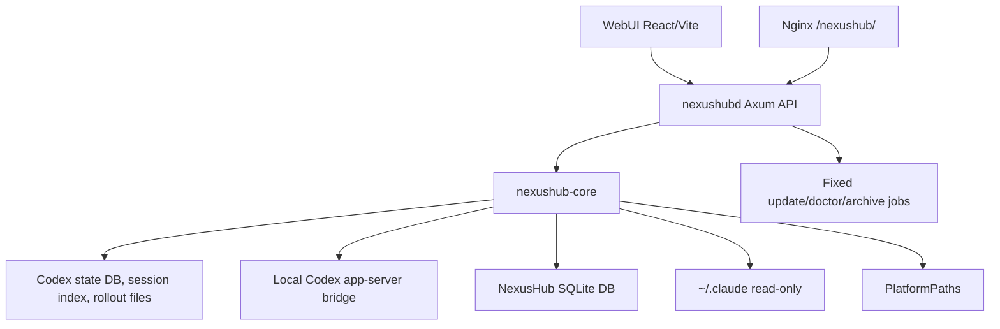

# Project Overview

## Preliminary Direction

Build `NexusHub` as a new repo based on `codex-cloud-panel`, keep the Codex chain intact, migrate conservative Sentinel surfaces, and add a read-only Claude Code provider framework inspired by multi-provider IDE consoles without copying AGPL source.

## Current Architecture



The daemon listens on `127.0.0.1:15742` and is intended to be exposed only through an HTTPS reverse proxy under `/nexushub/`. Codex create/send/stop/thread actions use the local app-server bridge first. Official Codex state remains the source of truth for thread and rollout reads.

## Technology Stack

| Layer | Current | Target |
|:--|:--|:--|
| Language | Rust 2021, TypeScript | Same |
| Backend | Axum, Tokio, rusqlite | Provider-oriented Axum API |
| Frontend | React 18, Vite, TanStack Query, lucide-react | Same visual shell with provider pages |
| Build Tool | Cargo, pnpm 11.0.8, Vite | Same |
| Database | NexusHub SQLite plus official Codex DB reads | Same; no Codex schema mutation |
| Deployment | Linux systemd under `/opt/nexushub`, Nginx `/nexushub/` | Linux first; macOS launchd and Windows Service preview |

## Entry Points

- Backend CLI and daemon: `crates/nexushubd/src/main.rs`
- Backend API routes: `crates/nexushubd/src/api.rs`
- Core library exports: `crates/nexushub-core/src/lib.rs`
- Provider registry: `crates/nexushub-core/src/providers.rs`
- Claude Code preview: `crates/nexushub-core/src/claude_code.rs`
- Sentinel preview: `crates/nexushub-core/src/sentinel.rs`
- Platform path model: `crates/nexushub-core/src/platform.rs`
- WebUI shell: `webui/src/App.tsx`
- WebUI API client/tests: `webui/src/lib/api.ts`, `webui/src/lib/api.test.ts`
- Linux install/update: `deploy/nexushub/install.sh`, `deploy/nexushub/update.sh`

## Build & Run

```bash
cargo fmt --all -- --check
cargo test --workspace
cargo clippy --workspace --all-targets -- -D warnings
corepack pnpm@11.0.8 --dir webui test
corepack pnpm@11.0.8 --dir webui build
bash scripts/test-install-script.sh
```

Canonical Linux packaging is `bash scripts/package-linux.sh` on Linux x86_64. Local macOS smoke archives require `ALLOW_HOST_MISMATCH=1` and are not release artifacts.

## Testing Baseline

Rust has unit and integration tests in `nexushub-core`, `nexushubd`, and script validation through `scripts/test-install-script.sh`. WebUI has Vitest tests for API helpers and message-store behavior plus a TypeScript/Vite build. Current gaps are end-to-end browser tests, live bridge integration tests, real cloud deploy smoke, macOS launchd packaging, and Windows Service packaging.

## Project Governance Baseline

`AGENTS.md` and `CLAUDE.md` are the active instruction surfaces. `docs/progress/MASTER.md` is the active LOCAL_ONLY progress tracker. There is no repo-local memory file; durable memory remains the active agent's native memory unless the user explicitly asks for a repo fallback.

## External Integrations

- Codex app-server bridge over local socket.
- Official Codex state DB under `/root/.codex/state_5.sqlite`.
- Codex rollout/session files under Codex home.
- Fixed cloud Codex admin wrappers under `/home/ubuntu/codex-admin/bin`.
- Turnstile login verification and encrypted secret storage.
- GitHub Releases for intended `lich13/nexushub` updates once a remote exists.
- Nginx reverse proxy under `/nexushub/`.
- Claude Code read-only files under `~/.claude`.

