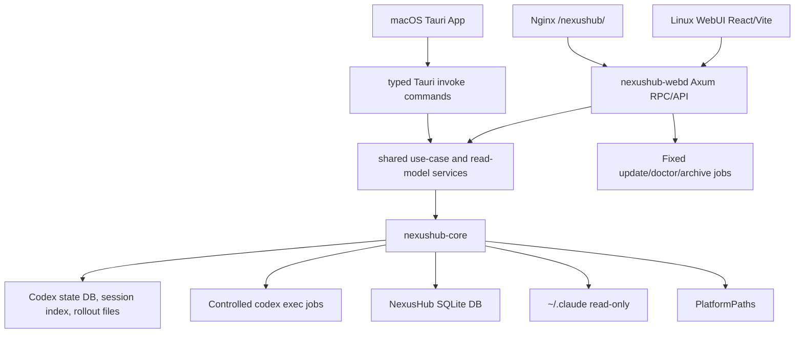

# Project Overview

## Preliminary Direction

Build `NexusHub` as a new repo based on `codex-cloud-panel`, keep Codex local-state compatibility intact, replace the cloud Sentinel runtime with a built-in Probe surface, and add a read-only Claude Code provider framework inspired by multi-provider IDE consoles without copying AGPL source.

## Current Architecture



The daemon listens on `127.0.0.1:15742` and is intended to be exposed only through an HTTPS reverse proxy under `/nexushub/`. Thread list/detail/status/Probe reads use official Codex local state. Create/send uses controlled `codex exec --json` jobs; actions that cannot be operated reliably from local state return an explicit unavailable response.

## Technology Stack

| Layer | Current | Target |
|:--|:--|:--|
| Language | Rust 2021, TypeScript | Same |
| Backend | Axum, Tokio, rusqlite | Provider-oriented Axum API |
| Frontend | React 18, Vite, TanStack Query, lucide-react | Same visual shell with provider pages |
| Build Tool | Cargo, pnpm 11.0.8, Vite | Same |
| Database | NexusHub SQLite plus official Codex DB reads | Same; no Codex schema mutation |
| Deployment | Linux systemd `nexushub-webd` under `/usr/local/bin`, `/usr/share/nexushub-webd`, `/etc/nexushub-webd`, `/var/lib/nexushub-webd`, and `/var/log/nexushub-webd`; Nginx `/nexushub/`; macOS/Linux Tauri App | Linux server WebUI plus macOS/Linux native apps; Windows Service remains planned |

## Entry Points

- Backend CLI and daemon: `crates/nexushub-webd/src/main.rs`
- Backend API router and adapters: `crates/nexushub-webd/src/api.rs`, `crates/nexushub-webd/src/api/*`
- Core library exports and Codex read model: `crates/nexushub-core/src/lib.rs`, `crates/nexushub-core/src/codex.rs`, `crates/nexushub-core/src/codex/*`
- Provider registry: `crates/nexushub-core/src/providers.rs`
- Claude Code preview: `crates/nexushub-core/src/claude_code.rs`
- Built-in Probe runtime: `crates/nexushub-core/src/probe.rs`
- Platform path model: `crates/nexushub-core/src/platform.rs`
- WebUI shell and domain components: `webui/src/App.tsx`, `webui/src/components/*`, `webui/src/lib/domain/*`
- macOS Tauri runtime entry: `src-tauri/src/lib.rs`, `src-tauri/src/commands/*`, `src-tauri/src/services/*`
- WebUI API client/tests: `webui/src/lib/api.ts`, `webui/src/lib/api.test.ts`
- Linux install/update: `deploy/nexushub-webd/install.sh`, `deploy/nexushub-webd/update.sh`

## Build & Run

```bash
cargo fmt --all -- --check
cargo test --workspace
cargo clippy --workspace --all-targets -- -D warnings
corepack pnpm@11.0.8 --dir webui test
corepack pnpm@11.0.8 --dir webui build
bash scripts/test-install-script.sh
```

Canonical Linux server packaging is `bash scripts/package-webd-linux-x86_64.sh` on Linux x86_64. `scripts/package-linux.sh` is only a deprecated shim. macOS/Linux desktop packaging targets native Tauri App entries, not a LaunchAgent Web service or Tencent Cloud GUI. All host surfaces share contracts through `contracts/nexushub-contract.json`, core use-case/read-model services, WebUI query/domain/runtime helpers, and thin Linux RPC or Tauri invoke adapters.

`lich13/cc-switch` is a reference, not a source to copy blindly. GitHub `cc-switch main` is primarily a Tauri desktop release architecture with a broader OS matrix, while local or experimental cc-switch `webd` branches are useful only as FHS/headless packaging references. NexusHub keeps the stricter shared core/use-case/contract/adapter split and does not replace it with a monolithic string dispatcher.

## Testing Baseline

Rust has unit and integration tests in `nexushub-core`, `nexushub-webd`, Tauri command/service coverage, and script validation through `scripts/test-install-script.sh`. WebUI has Vitest tests for API helpers, capability rendering, contract registry parity, message-store behavior, and a TypeScript/Vite build. The active release acceptance matrix is maintained in `docs/progress/MASTER.md`; current acceptance requires Tencent Cloud Linux WebUI checks, official macOS Tauri DMG checks, and Linux Tauri release asset/`xvfb` smoke checks for each release. Windows Service packaging remains planned.

Current Linux release assets are intentionally split by duty: `nexushub-webd-linux-x86_64.tar.gz` for the Tencent Cloud headless WebUI daemon and `NexusHub-*-Linux-x86_64.AppImage/.deb/.rpm` for Linux Tauri desktop. Windows and Linux arm64 remain outside the current acceptance target unless a future Goal explicitly adds those release lines.

## Project Governance Baseline

`AGENTS.md` is the active shared instruction surface. `CLAUDE.md` is intentionally absent because the user deleted it, and agents must not restore it unless the user explicitly requests that file. `docs/progress/MASTER.md` tracks the released Linux state. There is no repo-local memory file; durable memory remains the active agent's native memory unless the user explicitly asks for a repo fallback.

## External Integrations

- Official Codex state DB under `/root/.codex/state_5.sqlite`.
- Codex rollout/session files under Codex home.
- Controlled `codex exec --json` jobs for create/send.
- Fixed cloud Codex admin wrappers under `/home/ubuntu/codex-admin/bin`.
- Turnstile login verification and encrypted secret storage.
- GitHub Releases for `lich13/nexushub` updates.
- Nginx reverse proxy under `/nexushub/`.
- Claude Code read-only files under `~/.claude`.
