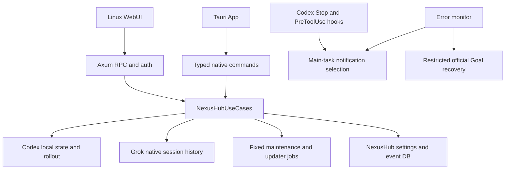

# Project Overview

## Current Architecture

NexusHub has two host surfaces sharing one React application: embedded macOS/Linux Tauri and Tencent Cloud Linux WebUI. Desktop does not host a LAN Web service.

```mermaid
flowchart TD
    Browser[Linux WebUI] --> API[Axum RPC and auth]
    Desktop[Tauri App] --> Invoke[Typed native commands]
    API --> Facade[NexusHubUseCases]
    Invoke --> Facade
    Facade --> Codex[Codex local state and rollout]
    Facade --> Grok[Grok native session history]
    Facade --> Maintenance[Fixed maintenance and updater jobs]
    Facade --> DB[NexusHub settings and event DB]
    Hooks[Codex Stop and PreToolUse hooks] --> Probe[Main-task notification selection]
    Monitor[Error monitor] --> Probe
    Monitor --> Goal[Restricted official Goal recovery]
```

## Ownership

- Core owns DTOs, identity/source classification, canonical turn selection, bounded read caches, cleanup validation and maintenance plans.
- HTTP and Tauri adapters own transport and host effects. Shared contracts enter through `NexusHubUseCases`; the registry is the API allowlist/parity boundary.
- Components render views; query hooks own requests and cache effects; pure domain helpers own state/copy.
- Grok reads local history, renames via fixed native stdio and deletes only a confirmed session directory. It never starts a task or joins Probe monitoring.
- Probe notifies only confirmed main tasks. Completion text must be a final answer from the canonical turn; unresolved questions retain call identity and one-second confirmation.
- The error monitor can change only blocked/usageLimited/budgetLimited Goals to active. It never starts a turn, injects messages, or restores paused/complete Goals.
- On macOS the fixed monitor LaunchAgent survives App closure without a port. Linux reuses the existing server process.

## Retired Surfaces

Task creation, send/steer/stop/fork, attachments, follow-up execution, question/plan/approval actions, manual Goal RPC, Claude and desktop LAN WebUI are removed. Historical SQLite rows remain, without fallback or execution paths. Retired HTTP commands return `404`.

## Security

No public Codex socket, shell, `/v1`, `/responses` or metrics. Server mutations retain session/CSRF checks. Bark bodies are not persisted; diagnostics are bounded and redacted. Cleanup requires dry-run, expected count and confirmation. Unknown identities fail closed for automatic notifications and recovery.
