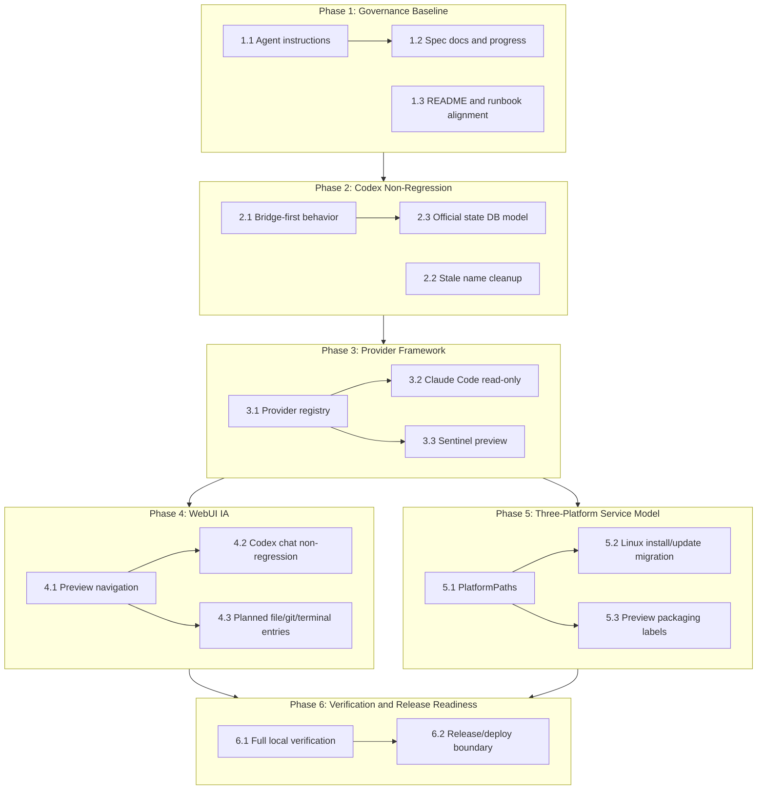

# Task Dependency Graph

```mermaid
graph TD
    subgraph P1 [Phase 1: Governance Baseline]
        T11[1.1 Agent instructions]
        T12[1.2 Spec docs and progress]
        T13[1.3 README and runbook alignment]
        T11 --> T12
    end

    subgraph P2 [Phase 2: Codex Non-Regression]
        T21[2.1 Bridge-first behavior]
        T22[2.2 Stale name cleanup]
        T23[2.3 Official state DB model]
        T21 --> T23
    end

    subgraph P3 [Phase 3: Provider Framework]
        T31[3.1 Provider registry]
        T32[3.2 Claude Code read-only]
        T33[3.3 Sentinel preview]
        T31 --> T32
        T31 --> T33
    end

    subgraph P4 [Phase 4: WebUI IA]
        T41[4.1 Preview navigation]
        T42[4.2 Codex chat non-regression]
        T43[4.3 Planned file/git/terminal entries]
        T41 --> T42
        T41 --> T43
    end

    subgraph P5 [Phase 5: Three-Platform Service Model]
        T51[5.1 PlatformPaths]
        T52[5.2 Linux install/update migration]
        T53[5.3 Preview packaging labels]
        T51 --> T52
        T51 --> T53
    end

    subgraph P6 [Phase 6: Verification and Release Readiness]
        T61[6.1 Full local verification]
        T62[6.2 Release/deploy boundary]
        T61 --> T62
    end

    P1 --> P2
    P2 --> P3
    P3 --> P4
    P3 --> P5
    P4 --> P6
    P5 --> P6
```

